# AWS Security Logging & Monitoring Lab

## Overview

In this lab, I explored how Security Operations Center (SOC) analysts monitor and investigate activity inside an AWS cloud environment. The focus of this exercise was understanding how security logs from different AWS services can be collected, analyzed, and used to detect suspicious or malicious behavior.

Throughout this lab, I used **Splunk Enterprise** to analyze logs generated from several AWS services including **CloudTrail, GuardDuty, CloudFront, and S3 Data Events**. By investigating these logs, I practiced identifying unusual login activity, suspicious infrastructure changes, potential malware infections, and unauthorized access to sensitive files.

This project helped me understand how cloud security monitoring works in real-world SOC environments.

---

# What I Learned

During this lab, I learned several important concepts related to **AWS security monitoring and threat detection**.

### Understanding AWS Security Monitoring Areas

I learned that monitoring AWS environments requires visibility across three primary security areas:

**1. Control Plane**

The control plane includes all administrative actions performed in AWS such as:

- Logging into the AWS console
- Launching EC2 instances
- Creating S3 buckets
- Modifying security groups
- Changing IAM permissions

These actions are logged using **AWS CloudTrail**, which records all API calls made in an AWS account.

---

**2. Workloads**

Workloads refer to applications and operating systems running inside cloud virtual machines.

Examples include:

- Linux or Windows servers running on EC2
- Installed software and services
- System processes and malware activity

Monitoring workloads often involves traditional security tools such as:

- Endpoint detection tools
- System logs
- Security agents

---

**3. Managed Services**

AWS also provides managed services such as:

- Amazon S3
- Amazon RDS
- Amazon CloudFront
- Amazon VPC

These services generate their own logs which provide visibility into activities like file access, web requests, and network traffic.

---

# Tools and Technologies Used

During this lab I worked with several cloud security technologies.

**AWS Services**

- AWS CloudTrail
- AWS GuardDuty
- Amazon EC2
- Amazon S3
- Amazon CloudFront
- Amazon VPC Flow Logs
- AWS CloudWatch

**Security Tools**

- Splunk Enterprise (SIEM)

**Skills Practiced**

- Cloud log analysis
- Threat hunting
- Investigating suspicious AWS activity
- Splunk search queries
- Security incident investigation

---

# Lab Activities and Investigation Process

## 1. Investigating AWS Console Logins (CloudTrail)

The first task involved analyzing **CloudTrail logs** to identify user login activity in the AWS console.

CloudTrail records every API call made within AWS, making it a critical data source for SOC analysts.

### Splunk Query Used

```
index=aws eventName=ConsoleLogin
```

Using this query, I searched for console login events and identified a login performed by the user:


```
jeff.harrison
```

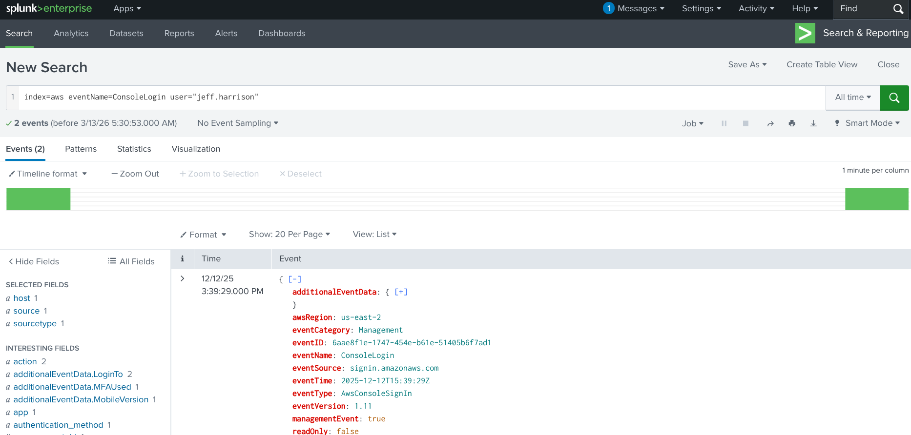

### Findings

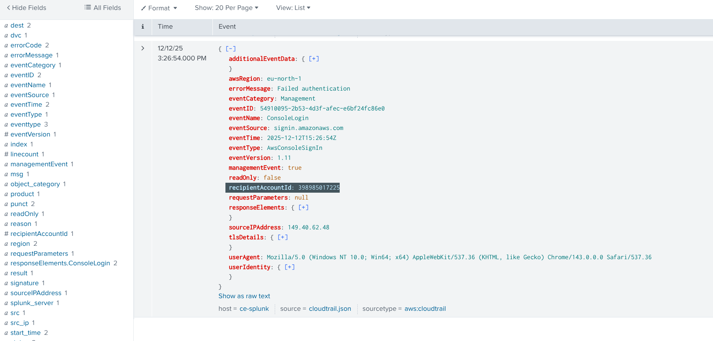


The login originated from the following IP address:

```
149.40.62.48
```

The login occurred in the following AWS account:

```
398985017225
```

This exercise helped me understand how SOC analysts track user login activity and identify the source of AWS console access.

---

# Investigating S3 Bucket Creation

After identifying the login activity, I searched for actions performed by the same user.

### Splunk Query Used

```
index=aws user_name="jeff.harrison" eventName=CreateBucket
```

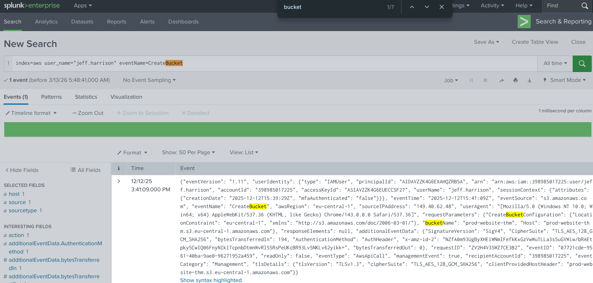


### Result

The user created the following S3 bucket:

```
prod-website-thm
```

This step demonstrated how CloudTrail logs can be used to trace infrastructure changes made by users after logging into AWS.

---

# Investigating GuardDuty Alerts

Next, I analyzed **GuardDuty alerts** to identify suspicious activity detected automatically by AWS.

GuardDuty is a threat detection service that analyzes AWS logs and generates alerts when suspicious behavior is detected.

### Splunk Query Used

```
index=aws sourcetype=aws:cloudwatch:guardduty
```

### Alert Identified

The system detected the following alert type:

```
AnomalousBehavior
```

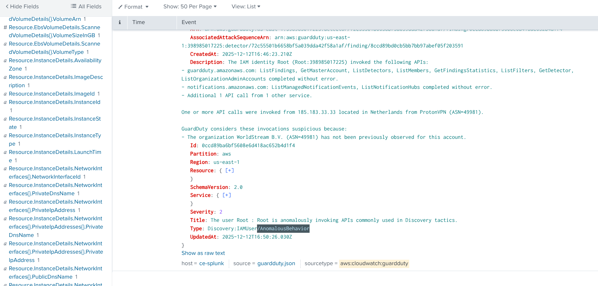

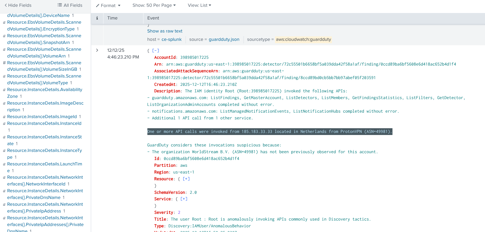


### Source of Suspicious Activity

The activity originated from the IP address:

```
185.183.33.33
```

This IP address was associated with:

```
ProtonVPN
```

and was located in:

```
Netherlands
```

This investigation demonstrated how VPN-based access can be identified during threat investigations.

---

# Malware Detection in EC2 Instance

The GuardDuty alerts also indicated suspicious activity related to an EC2 instance.

### Affected EC2 Instance

```
i-04fa0268276e1f763
```

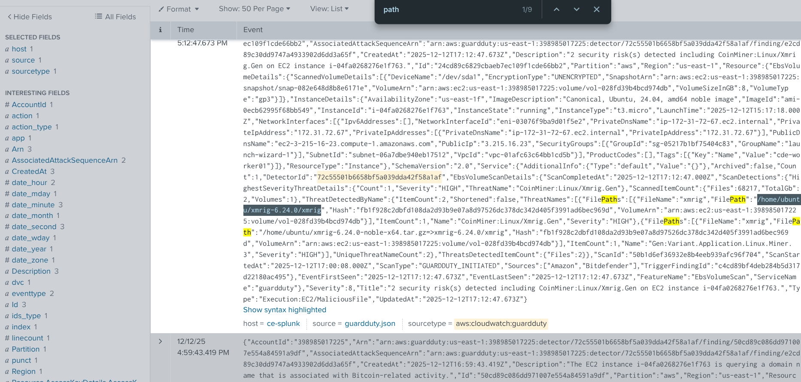


Further investigation revealed a malware file located at:

```
/home/ubuntu/xmrig-6.24.0/xmrig
```

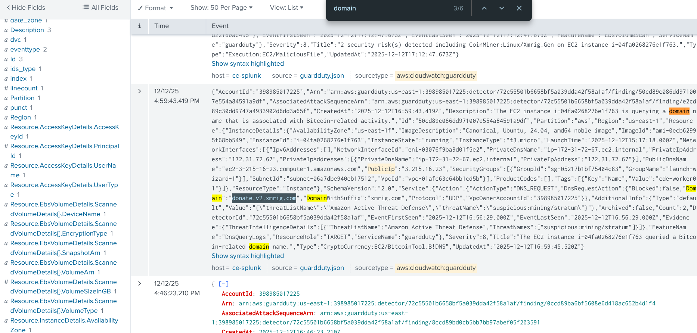


The malware contacted the following domain:

```
donate.v2.xmrig.com
```

This domain is associated with **XMRig cryptocurrency mining software**, indicating that the EC2 instance was likely infected with **cryptomining malware**.

This part of the lab helped me understand how compromised cloud workloads can be detected through log analysis.

---

# Identifying Who Created the EC2 Instance

To understand how the compromised instance was created, I analyzed CloudTrail logs for EC2 instance creation events.

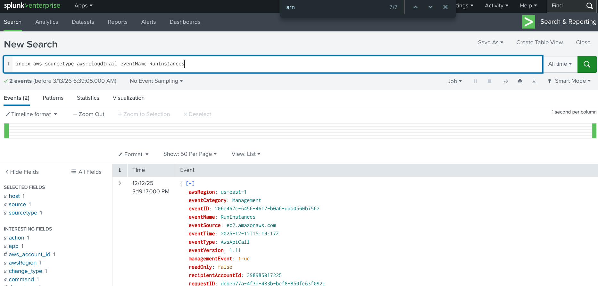

### Splunk Query Used

```
index=aws sourcetype=aws:cloudtrail eventName=RunInstances
```

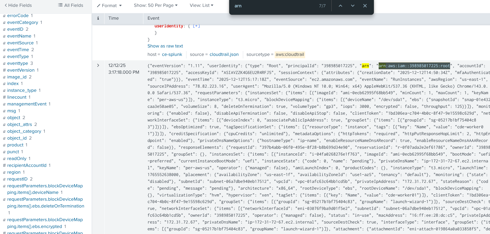


### Result

The EC2 instance was created by the following AWS identity:

```
arn:aws:iam::398985017225:root
```

This investigation demonstrated how CloudTrail can be used to determine **who created a resource that later became compromised**.

---

# Investigating Security Group Exposure

Next, I investigated the **security group configuration** associated with the EC2 instance.

### Splunk Query Used

```
index=aws sourcetype=aws:cloudtrail "sg-05217b1bf75404c83"
```

### Risky Ports Identified

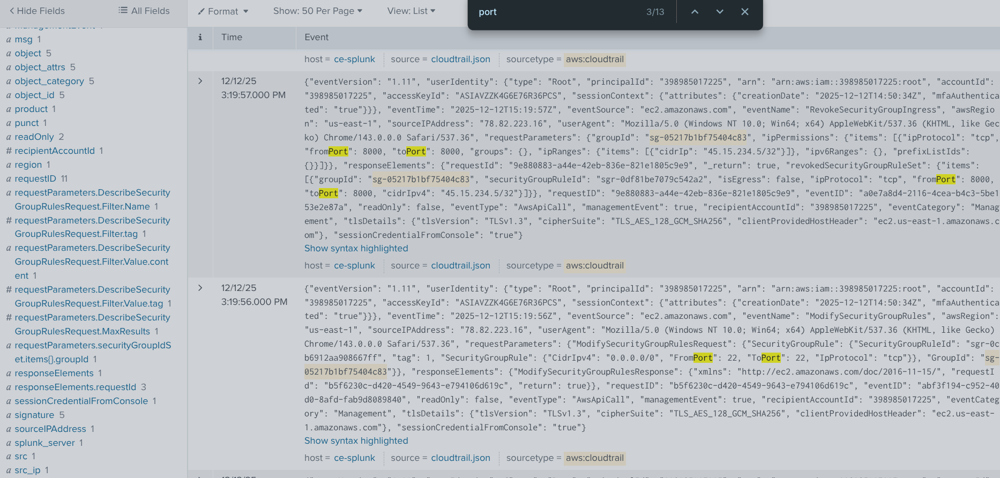

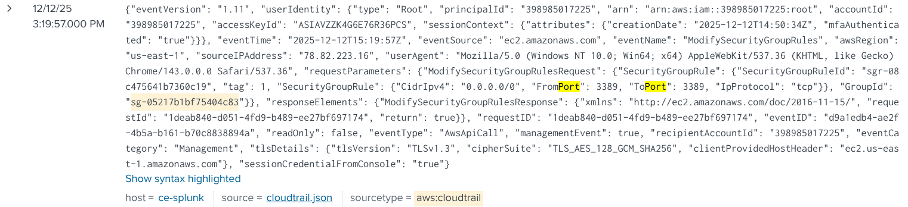


The following ports were exposed to the internet:

```
22
3389
```

These ports correspond to:

- **Port 22 (SSH)**
- **Port 3389 (RDP)**

Exposing these ports publicly can make systems vulnerable to **brute-force attacks**.

---

# CloudFront Log Analysis

I also analyzed **CloudFront access logs** to identify web activity.

### Splunk Query Used

```
index=aws source="cloudfront.log"
```

### Finding

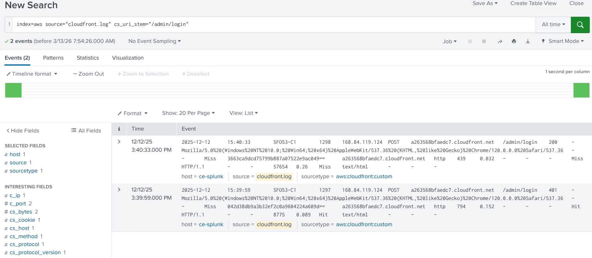


An IP address that accessed the **admin portal** was identified as:

```
168.84.119.124
```

This activity could indicate an attempt to access administrative interfaces of the web application.

---

# S3 Data Events Investigation

Finally, I analyzed **S3 Data Event logs** to detect access to sensitive files stored in Amazon S3.

### Splunk Query Used

```
index=aws source="s3.json"
```

### Result

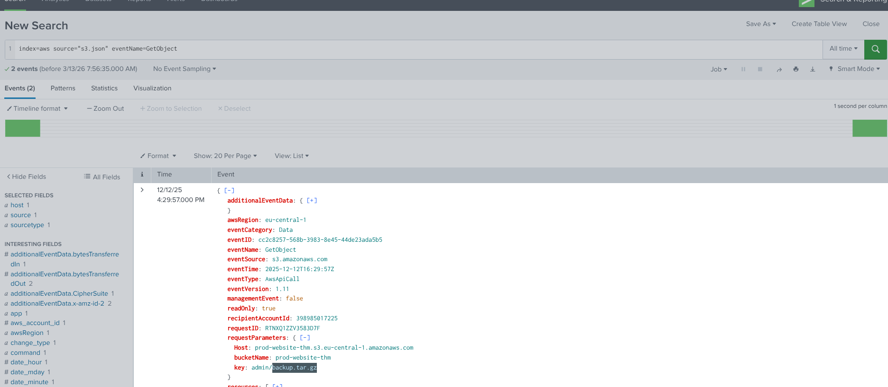


The following file was accessed:

```
backup.tar.gz
```

This type of file may contain important backup data and could be targeted during **data exfiltration attacks**.

---

# Key Skills Developed

Through this lab, I strengthened several cloud security skills including:

- AWS security log analysis
- Threat detection using SIEM tools
- Investigating suspicious AWS logins
- Tracking infrastructure changes in cloud environments
- Identifying malware activity in EC2 instances
- Analyzing web access logs
- Monitoring access to sensitive cloud storage

---

# Conclusion

This lab provided hands-on experience with monitoring and investigating activity in AWS environments. By analyzing logs from multiple AWS services, I was able to identify suspicious login behavior, detect potential malware infections, investigate exposed infrastructure, and monitor access to sensitive data.

The experience reinforced the importance of centralized logging and SIEM analysis for detecting security incidents in cloud environments.

---
